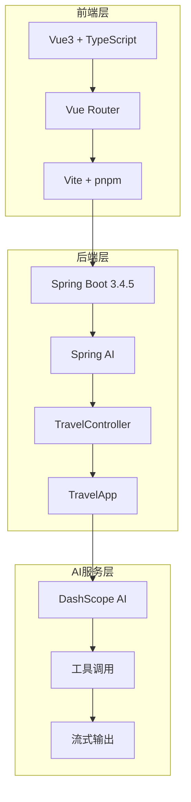
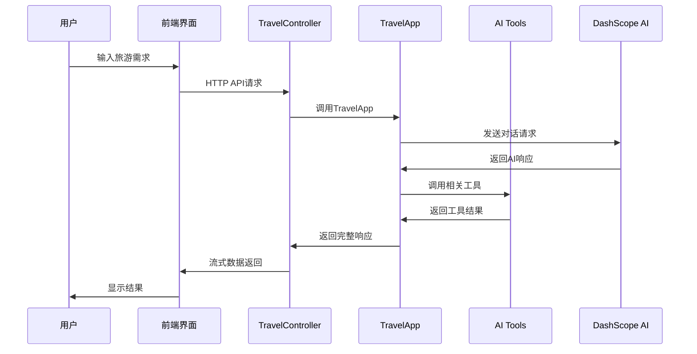

# AI旅游规划大师系统

一个基于Spring Boot + Vue3的智能旅游规划系统，集成了AI对话、工具调用、MCP服务等功能。

## 🚀 快速开始

### 后端启动
```bash
# 启动Spring Boot应用
mvn spring-boot:run
```
后端服务将在 `http://localhost:8123` 启动

### 前端启动
```bash
# 进入前端目录
cd simple-frontend

# 安装依赖
pnpm install

# 启动开发服务器
pnpm dev
```
前端应用将在 `http://localhost:3000` 启动

## 📋 系统特性

### 🎯 核心功能
- **AI旅游规划对话** - 智能分析用户需求，提供个性化旅游建议
- **智能体多步骤规划** - 使用AI智能体进行复杂的多步骤旅游规划
- **工具集成** - 集成景点搜索、酒店查询、路线规划、天气查询等工具
- **MCP服务集成** - 支持高德地图、小红书等外部MCP服务
- **流式输出** - 支持实时流式对话体验

### 🛠️ 技术栈
- **后端**: Spring Boot 3.4.5, Spring AI, Alibaba Cloud AI
- **前端**: Vue 3, TypeScript, Vite, Vue Router
- **AI模型**: DashScope (阿里云), Ollama
- **数据库**: MySQL (聊天记忆), PostgreSQL (向量存储)
- **工具**: Maven, pnpm

## 📁 项目结构

```
zl-ai-agent/
├── src/main/java/com/zluolan/zaiagent/
│   ├── app/                    # 核心应用逻辑
│   ├── agent/                  # AI智能体
│   ├── controller/             # REST API控制器
│   ├── tools/                  # AI工具
│   ├── mcp/                    # MCP服务集成
│   └── config/                 # 配置类
├── simple-frontend/            # Vue3前端应用
│   ├── src/pages/              # 页面组件
│   ├── src/composables/        # 组合式函数
│   └── src/styles/             # 样式文件
└── docs/                       # 项目文档
```

## 🔧 API接口

### 旅游规划接口
- `GET /api/travel/chat/sync` - 同步对话
- `GET /api/travel/chat/stream` - 流式对话
- `GET /api/travel/agent/chat` - 智能体对话
- `GET /api/travel/chat/mcp` - MCP工具对话

### 工具演示接口
- `GET /api/travel/tools/attraction?demo=true` - 景点搜索演示
- `GET /api/travel/tools/hotel?demo=true` - 酒店搜索演示
- `GET /api/travel/tools/route?demo=true` - 路线规划演示
- `GET /api/travel/tools/weather?demo=true` - 天气查询演示

## 🎨 前端页面

### 主页 (Home.vue)
- 四卡片导航设计
- 统一的设计风格
- 快速功能入口

### 旅游聊天 (TravelChat.vue)
- AI旅游规划对话
- 流式输出显示
- 快速开始按钮

### 智能体助手 (TravelAgent.vue)
- 多步骤智能规划
- 安全过滤器处理
- 智能对话交互

### 旅游工具集 (Tools.vue)
- 工具功能演示
- 实时API调用
- 结果展示

## 🧪 测试

### 运行所有测试
```bash
mvn test
```

### 测试覆盖
- **控制器测试** - API接口功能验证
- **应用测试** - 核心业务逻辑测试
- **工具测试** - AI工具功能测试
- **智能体测试** - AI智能体行为测试

## 📊 系统架构



## 🔄 数据流



## 🚀 部署

### 开发环境
1. 确保Java 21+和Node.js 18+已安装
2. 启动后端: `mvn spring-boot:run`
3. 启动前端: `cd simple-frontend && pnpm dev`

### 生产环境
1. 构建后端: `mvn clean package`
2. 构建前端: `cd simple-frontend && pnpm build`
3. 部署到服务器

## 📝 配置说明

### 后端配置 (application.yml)
```yaml
server:
  port: 8123
  servlet:
    context-path: /

spring:
  ai:
    dashscope:
      api-key: ${DASHSCOPE_API_KEY}
```

### 前端配置 (vite.config.ts)
```typescript
export default defineConfig({
  server: {
    port: 3000,
    proxy: {
      '/api': {
        target: 'http://localhost:8123',
        changeOrigin: true,
      },
    },
  },
})
```

## 🤝 贡献

欢迎提交Issue和Pull Request来改进项目！

## 📄 许可证

MIT License