# 系统架构文档

## 🏗️ 整体架构

AI旅游规划大师系统采用前后端分离的架构设计，结合Spring AI和Vue3技术栈，提供智能化的旅游规划服务。

### 架构层次

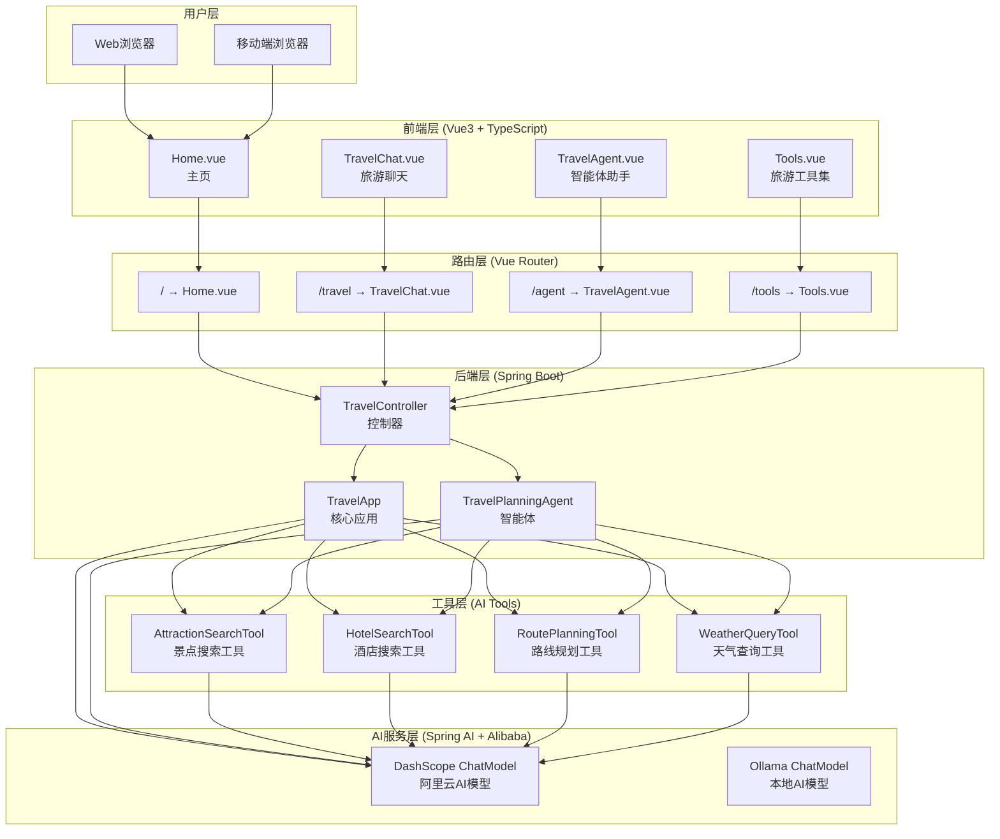

## 🔄 数据流架构

### 用户交互流程

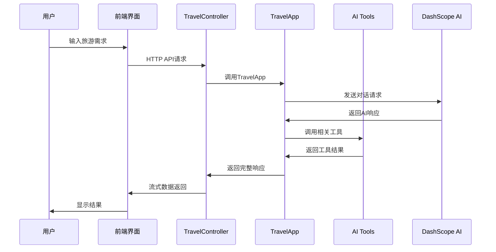

### 智能体交互流程

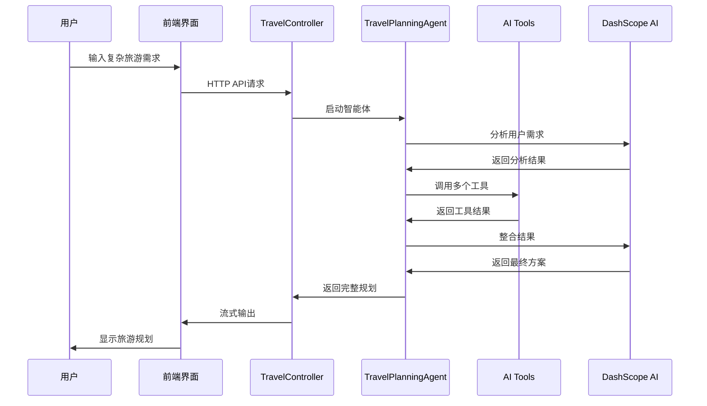

## 🧩 核心组件

### 前端组件架构

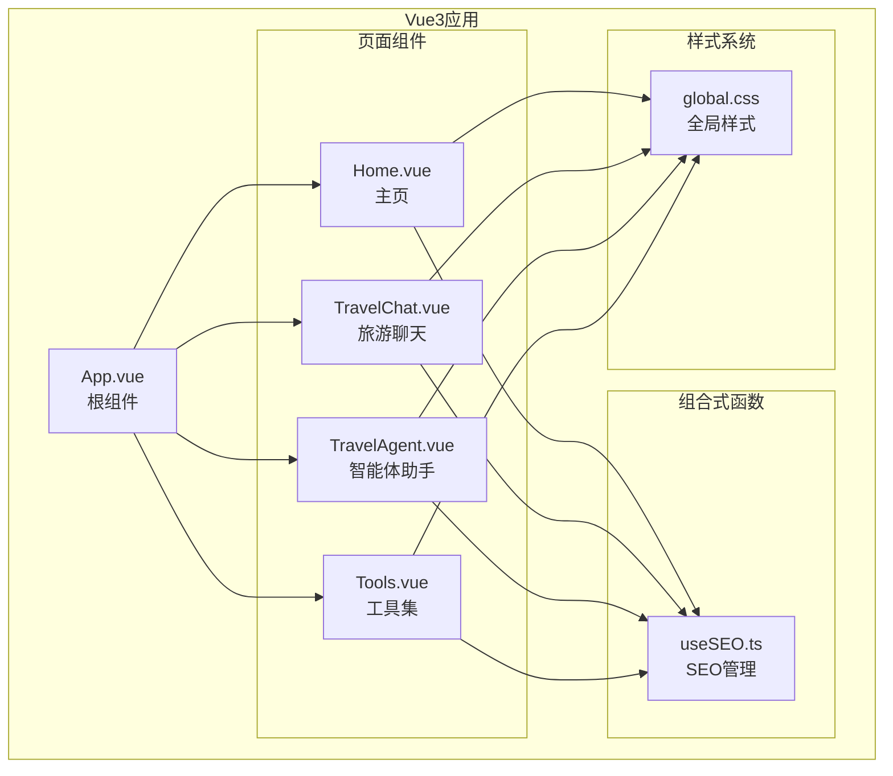

### 后端组件架构

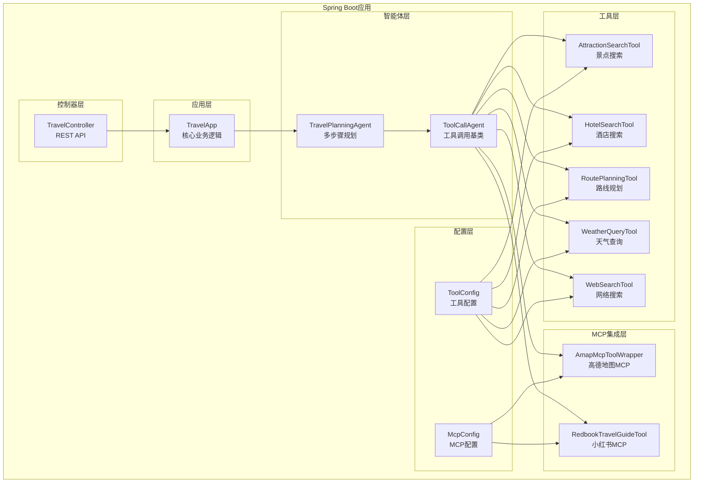

## 🗄️ 数据存储架构

### 聊天记忆存储

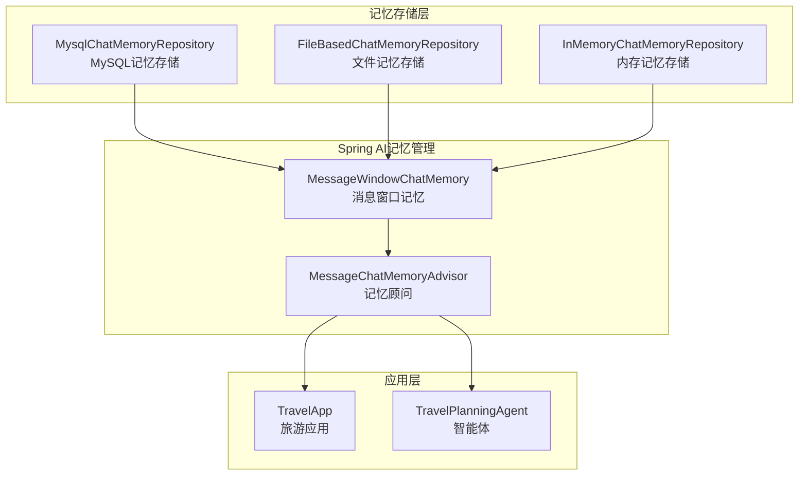

## 🔧 配置架构

### Spring Boot配置

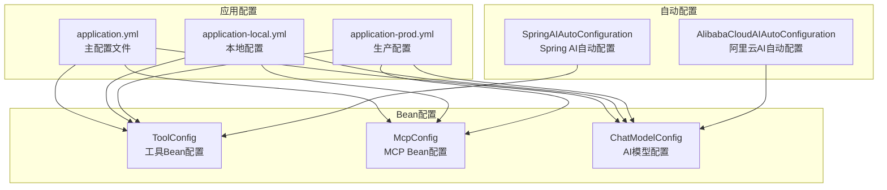

## 🚀 部署架构

### 开发环境

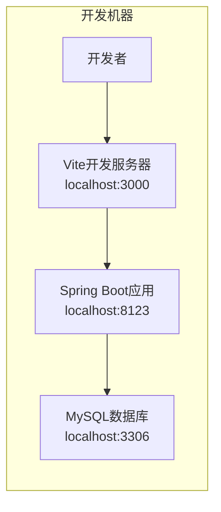

### 生产环境

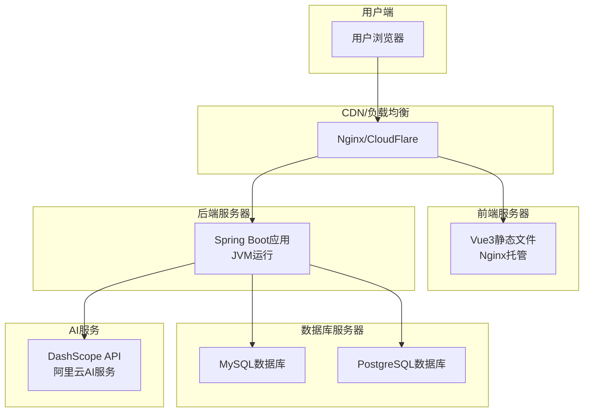

## 🔒 安全架构

### 安全层次

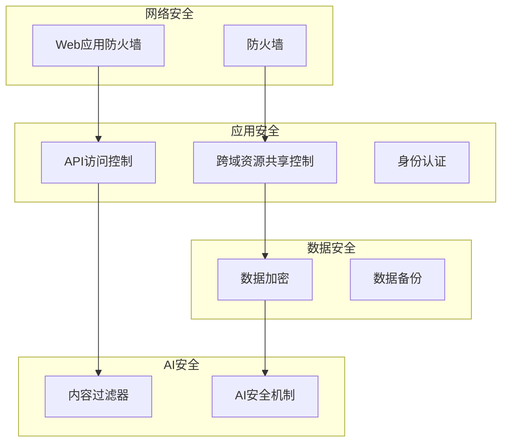

## 📊 监控架构

### 监控体系

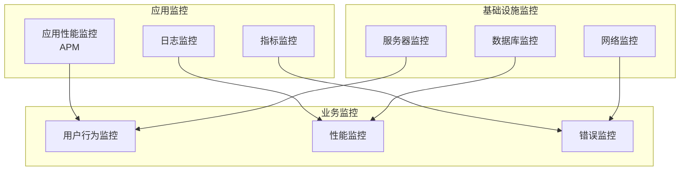

## 🔄 扩展架构

### 微服务扩展

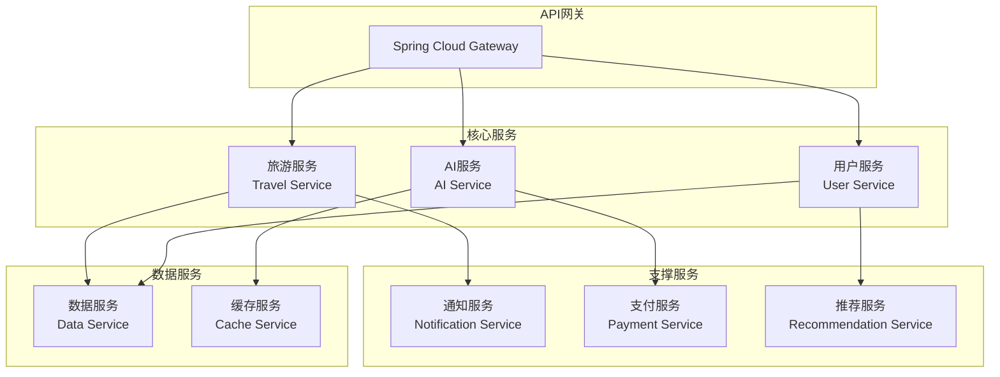

这个架构文档提供了系统的完整技术视图，包括组件关系、数据流、部署方案等，为系统的开发、维护和扩展提供了清晰的指导。
